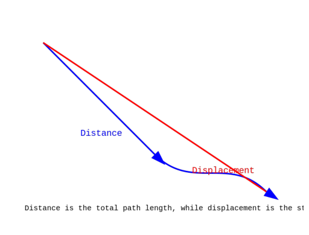

# Udility Diffuser

Udility Diffuser is a cutting-edge labeled-image generation model based on Meta Llama-3.5, designed to create illustrative images using SVG scripting and general inference technology. Unlike conventional diffusion models, Udility Diffuser generates labeled data that can be effectively utilized for educational and illustrative purposes.

[](https://colab.research.google.com/drive/1KASVA0PPRX055eSEu3vALhBLJmXK_-m6?usp=sharing)


## Architecture

Udility Diffuser follows a unique architecture that integrates Meta Llama-3.5 with SVG creation technologies. This approach enables the generation of labeled images that are suitable for both illustrative and educational purposes.


## Features

SVG Scripting: Utilizes SVG scripting for detailed, labeled image creation.
Text-Based Contexting: Generates images by reverse engineering the image generation process using text-based contexting.
Educational Focus: Designed specifically to create educational and illustrative images.
Meta Llama-3.5 Based: Powered by the latest Meta Llama-3.5 technology.
Installation

To get started with Udility Diffuser, ensure you have the latest package installed:

bash
Copy code
pip install Udility

## Dependencies

The following dependencies are automatically installed with Udility:

- **openai**
- **cairosvg**
- **matplotlib**
- **cairocffi**
- **cssselect2**
- **numpy**
- **httpx**
- **jiter**

## Setting Up

To use Udility Diffuser, you need to set up your environment with an OpenRouter API key:

```python
import os

# Set the OpenRouter API key as an environment variable
os.environ['OPENROUTER_API_KEY'] = 'Your_Openrouter_API_Key_Here'
```

You can obtain your free API key from OpenRouter, which allows you to connect with Meta Llama 3.4 and use the Nous Capybara's version of Llama 3.5 for free.

## Usage Examples

Generate labeled illustrations using simple text commands:

```python
from Udility import diffuser

# Example: Generate an image illustrating the difference between distance and displacement
diffuser.generate_image_from_text("Difference between distance and displacement.")

# Example: Generate an image of the lifecycle of an amoeba
diffuser.generate_image_from_text("Lifecycle of amoeba.")

# Example: Visualize accelerated motion on a graph
diffuser.generate_image_from_text("Visualisation of accelerated motion on a graph.")

# Example: Understand mathematical integration through visualization
diffuser.generate_image_from_text("Help me understand the mathematical integration using a visualisation.")
```

## Illustrations & Animations

### Illustrations

1. **Difference between Distance and Displacement**

   

2. **Visualization of Mathematical Integration**

   

3. **Visualization of Accelerated Motion**

   

4. **Lifecycle of an Amoeba**

   


## Future Developments

We are currently developing **Udility Animator**, a text-to-animation model built on Meta Llama 3.5 and Udility Diffuser. Stay tuned for updates and check out our demos:


### Animations

1. **Distance vs Displacement Animation**

   

2. **Lifecycle of an Amoeba Animation**

   

## Contribution

To access more projects from Udility or to join us as a contributor, please fill out the form here: [Join Udility](#)

## License

This project is licensed under the MIT License.

---

**Copyright**: Udility.com  
**Developer**: Udit Akhouri  
**Version**: v2.0 (1st public version)  

For more information, visit our website or contact us directly.

